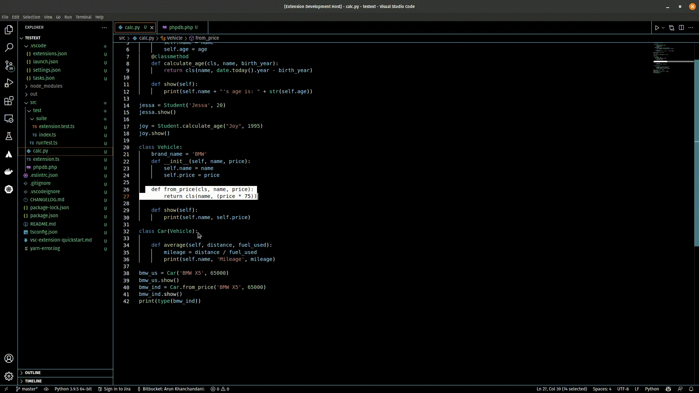

# VS Code Extension - DocString Comment Generator 

## Powered by Open AI

Automatically generate DocString Comments for Functions and Classes using the Open AI API.  

## Features

Simply Highlight and Right Click on a Function (in PHP, Python, Java, TypeScript or JavaScript) and Select `Generate DocString from Selection`

## Requirements

- Open AI API Key (Required) - [Visit Website](https://openai.com/api/)

## Extension Settings

This extension contributes the following settings:

* `vs-code-autocomment.openAI.key`: Open AI API Key
* `vs-code-autocomment.openAI.temperature`: Temperature (default: 0.9)
* `vs-code-autocomment.general.appendPredefinedExamples`: Append predefined examples (default: true)
* `vs-code-autocomment.openAI.engine`: Engine (default: 'davinci-codex')

## Release Notes

### 1.0.0

Initial release - Support for PHP, Python, Java, JavaScript and TypeScript
